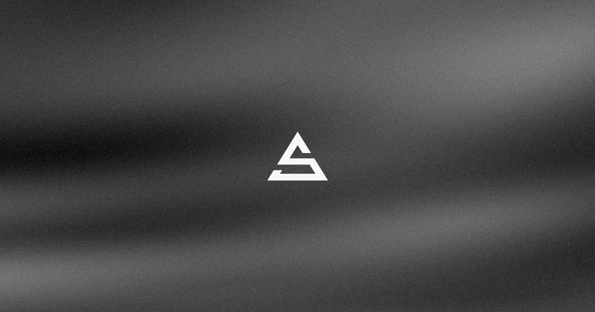

# Alvarosabu's Portfolio

This is my personal portfolio website, built with Nuxt, Nuxt UI, TresJS, Motion Framer Vue and TailwindCSS.

## License

Following [Anthony Fu's example](https://github.com/antfu/antfu.me) and [Daniel Roe's example](https://github.com/danielroe/roe.dev), the code is licensed under <a href='./LICENSE'>MIT</a>, and my words and original images are licensed under <a href='https://creativecommons.org/licenses/by-sa/4.0/'>CC BY-SA 4.0</a>.

### Exceptions

`app/components/home/sound-shape/raymarch.ts` is a TSL port of the ["Amplitude deformation"](https://www.kynd.info/geom/demos/sound-amplitude/) demo by [Kenichi Yoneda (Kynd)](https://www.kynd.info/), used under [CC BY-SA 4.0](https://creativecommons.org/licenses/by-sa/4.0/). Because that license is share-alike, **that file remains CC BY-SA 4.0 and is not covered by the MIT license above.** The rest of the `sound-shape` component (scene setup, post-processing, and the synthesized kick pattern) is my own work and is MIT.

The original demo is scored by [Yaporigami (Yu Miyashita)](https://yaporigami.com/); none of that audio is used here.